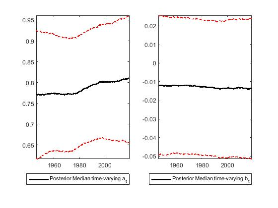
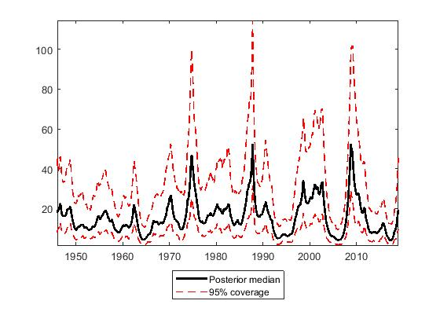
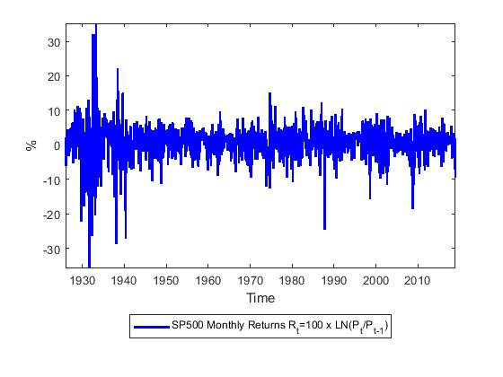

[](http://quantlet.de/)

## [](http://quantlet.de/) **TVP_VAR_Example3** [](http://quantlet.de/)

```yaml

Name of QuantLet : TVP_VAR_Example3

Published in : 'Haindorf Seminar 2020'

Description : 'S&P500 Monthly Returns, Posterior median of alpha and beta with confidence bands'

Keywords : 'S&P500, monthly returns, apple, Bayesian Estimation, time varying parameters'

See also : 'TVP_VAR_Example1, TVP_VAR_Example2, TVP_VAR_Example4'

Author : 'Mike Ellington'

Submitted : January 22 2020
```







### MATLAB Code
```matlab

% This file estimates stochastic volatility model on daily SP500 returns
% from 1990-01-01 -- 2018-12-31

% Model is as in slides r_{t} = \epsilon_{t}\sqrt(\exp(\ln(h_t)))
%                       \ln(h_t) = \ln(h_t-1) + \nu_{t}

clear; clc;
seed= 19122019;
rng(seed);
%
addpath('../src');
addpath('..');

y=xlsread('Example_3_data','Sheet1','C2:C1118');
Ttrain=240; % training sample 20 year training sample
yearlab=1926.00:(1/12):2018+(11/12)';


figure(1)
plot(yearlab,y,'b-','LineWidth',2)
ylabel('%')
xlabel('Time')
legend('SP500 Monthly Returns R_t=100 x LN(P_t/P_{t-1})','Location','SouthOutside')
axis tight
%matlab2tikz('SP500_monthly.tex')
%
T=length(y);
X=[lag0(y,1) ones(T,1)];
y=y(2:end,:);
X=X(2:end,:);
%
% independence Metropolis Hastings Algorithm for Stochastic Volatility
% Model Jacquer et al (2004).

% STEP 1: Priors for g~iG(V0,T0) and the initial conditions for the stochastic
% volatility, plus the initial conditions for the Kalman filter
V0=0.01; % prior scale
T0=1; % prior degrees of freedom

y0=y(1:Ttrain,:); 
X0=X(1:Ttrain,:);
B0=X0\y0; % OLS ESTIMATE
e0=y0-X0*B0;
s0=(e0'*e0)/T0;
VV0=s0*inv(X0'*X0);

mu=log(std(e0)^2);
sigma=10;

% STEP 2: Set starting values for time-varying coefficients
beta0=B0;
p00=VV0;

% STEP 3: Prior for Q
Q0=(VV0*T0)*0.0001;
Q=Q0;  % initial value

% Now remove Training Sample
y=y(Ttrain+1:end,:); X=X(Ttrain+1:end,:); T=length(y);

% STEP 4: Starting Values for Stochastic Volatility
hlast=diff(y).^2;
hlast=[hlast(1:2); hlast]+0.0001; % add small number to ensure no zero value
errors=diff(y); errors=[errors(1); errors];
%%
g=1;
Nsim=30000; burn=25000;
svol=zeros(T+1,Nsim-burn);
TVC1=zeros(T,Nsim-burn);
TVC2=TVC1;
tic;
for kk=1:Nsim
% STEP 5: Date by date MH algorithm to draw SVOL
hnew=zeros(T+1,1);

i=1;
% time period 0 (initial condition)

hlead=hlast(i+1); 
ss=sigma*g/(g+sigma); % variance
mu1=ss*(mu/sigma + log(hlead)/g); % mean
% draw from lognormal distribution using mu and ss
h = exp(mu+(ss^.5)*randn(1,1));
hnew(i)=h;

% time period 1:t-1
for i=2:T
    hlead=hlast(i+1);
    hlag=hnew(i-1);
    yt=errors(i-1);
   
%mean and variance of the proposal log normal density
mu = (log(hlead)+log(hlag))/2;  
ss = g/2;

%candidate draw from lognormal
htrial = exp(mu + (ss^.5)*randn(1,1));

%acceptance probability in logs
lp1 = -0.5*log(htrial) - (yt^2)/(2*htrial);  %numerator
lp0 = -0.5*log(hlast(i)) - (yt^2)/(2*hlast(i));   %denominator
accept = min([1;exp(lp1 - lp0)]);  %ensure accept<=1

u = rand(1,1);
if u <= accept;
   h = htrial;
else
   h = hlast(i);
end
hnew(i)=h;
end

%time period T
i=T+1;
yt=errors(i-1);
hlag=hnew(i-1);
%mean and variance of the proposal density
mu = log(hlag);   % only have ht-1
ss = g;
%candidate draw from lognormal
htrial = exp(mu + (ss^.5)*randn(1,1));

%acceptance probability
lp1 = -0.5*log(htrial) - (yt^2)/(2*htrial);
lp0 = -0.5*log(hlast(i)) - (yt^2)/(2*hlast(i));
accept = min([1;exp(lp1 - lp0)]);  %ensure accept<=1


u = rand(1,1);
if u <= accept;
   h = htrial;
else
   h = hlast(i);
end
hnew(i)=h;

% STEP 6: Draw g from iG distribution
gerrors=diff(log(hnew));
g=iG(T0,V0,gerrors);  %draw from the inverse Gamma distribution


% STEP 7: update vale of h
hlast=hnew;
% STEP 8: Get TVC from CK algorithm
[beta,errors]=carterkohn1(beta0',p00,hlast,Q,y,X);
% STEP 9: Get Q
errQ=diff(beta);
scQ=(errQ'*errQ)+Q0;
Q=iwpQ(T+Ttrain,inv(scQ));

% save output
%save
if kk>burn
kk
svol(:,kk-burn)=hlast;
TVC1(:,kk-burn)=beta(:,1);
TVC2(:,kk-burn)=beta(:,2);
end

end
toc;
%%
SVQ=quantile(svol,[0.025, 0.5, 0.975],2);
BB=quantile(TVC1,[0.16, 0.5, 0.84],2);
AA=quantile(TVC2,[0.16, 0.5, 0.84],2);


figure(2)
plot(yearlab(Ttrain+1:end),SVQ(:,2),'k-','LineWidth',2)
hold on,
plot(yearlab(Ttrain+1:end),SVQ(:,1),'r--','LineWidth',1.2)
plot(yearlab(Ttrain+1:end),SVQ(:,3),'r--','LineWidth',1.2)
legend('Posterior median','95% coverage','Location','SouthOutside')
axis tight
%matlab2tikz('SVOL_2.tex')

figure(3)
subplot(1,2,1)
plot(yearlab(Ttrain+2:end),AA(:,2),'k-','LineWidth',2)
hold on,
plot(yearlab(Ttrain+2:end),AA(:,1),'r--','LineWidth',1.2)
plot(yearlab(Ttrain+2:end),AA(:,3),'r--','LineWidth',1.2)
axis tight
legend('Posterior Median time-varying a_{t}','Location','SouthOutside') 
subplot(1,2,2)
plot(yearlab(Ttrain+2:end),BB(:,2),'k-','LineWidth',2)
hold on,
plot(yearlab(Ttrain+2:end),BB(:,1),'r--','LineWidth',1.2)
plot(yearlab(Ttrain+2:end),BB(:,3),'r--','LineWidth',1.2)
axis tight
legend('Posterior Median time-varying b_{t}','Location','SouthOutside')
%matlab2tikz('PARAM.tex')

```

automatically created on 2020-01-22